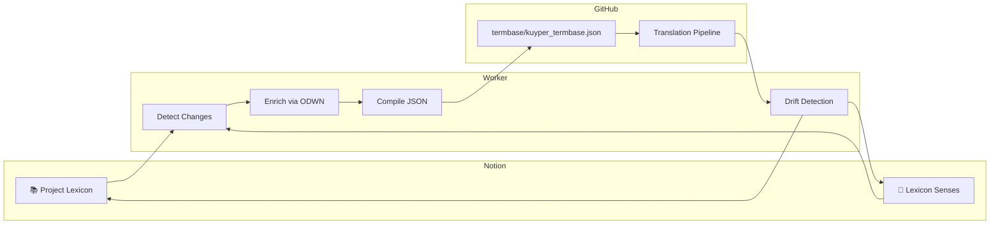

# PRD: Notion Worker — Bidirectional Termbase Sync Agent

> **For:** Notion AI review + engineering implementation  
> **Project:** OpenKuyper — Abraham Kuyper's *Antirevolutionaire Staatkunde* translation  
> **Goal:** Build a lightweight Python agent that syncs Notion Lexicon ↔ GitHub termbase JSON, with Dutch WordNet enrichment and drift detection  
> **Status:** Draft — ready for review and build  

---

## 1. Overview

The **Notion Worker** is a standalone Python script (`scripts/notion_worker.py`) that runs as a background agent. It ensures the Notion **📚 Project Lexicon** + **🔬 Lexicon Senses** databases remain the **canonical source of truth**, while the translation pipeline continues to read a fast local cache (`termbase/kuyper_termbase.json`).

The worker bridges two worlds:
- **Notion** = human-friendly curation UI (rich text, relations, status workflow)
- **GitHub/JSON** = machine-friendly pipeline input (fast, versioned, offline-capable)

---

## 2. Core Responsibilities



| Phase | Direction | Action |
|---|---|---|
| **Detect** | Notion → Worker | Query Notion API for terms edited since last checkpoint |
| **Enrich** | ODWN → Notion | For new/proposed terms, auto-lookup Dutch WordNet synsets and create sense rows |
| **Compile** | Notion → JSON | Flatten all `Locked`/`Approved` senses into `kuyper_termbase.json` |
| **Validate** | Pipeline → Worker | After translation run, check for terminology drift |
| **Report** | Worker → Notion | Write drift alerts back to affected term/sense rows |

---

## 3. Architecture

### 3.1 File Structure

```
scripts/
  notion_worker.py          # Main entry point
  notion_worker_config.py   # Configuration (DB IDs, API keys, paths)
  notion_worker_db.py       # SQLite checkpoint store
  notion_worker_sync.py     # Notion API read/write helpers
  notion_worker_odwn.py     # Dutch WordNet enrichment wrapper
  notion_worker_compile.py  # JSON compilation logic
  notion_worker_drift.py    # Drift detection engine
```

### 3.2 Configuration (`notion_worker_config.py`)

```python
NOTION_TOKEN = os.environ["NOTION_API_TOKEN"]
LEXICON_DB_ID = "b675507f-bad8-4478-abeb-00745a893f65"
SENSES_DB_ID = None  # Will be set after 🔬 Lexicon Senses is created
ODWN_XML_PATH = "reference/odwn/odwn_orbn_gwg-LMF_1.3.xml"
JSON_OUTPUT_PATH = "termbase/kuyper_termbase.json"
CHECKPOINT_DB_PATH = ".opencode/notion_worker.db"
SYNC_INTERVAL_SECONDS = 300  # 5 minutes
GIT_COMMIT_ON_CHANGE = True
```

### 3.3 Checkpoint Store (`notion_worker_db.py`)

SQLite table for idempotency:

```sql
CREATE TABLE checkpoints (
    id INTEGER PRIMARY KEY,
    last_sync_timestamp TEXT,  -- ISO 8601 from Notion last_edited_time
    pages_synced INTEGER,
    senses_synced INTEGER,
    drift_alerts_created INTEGER,
    git_commit_sha TEXT,
    run_at TIMESTAMP DEFAULT CURRENT_TIMESTAMP
);
```

---

## 4. Phase-by-Phase Design

### Phase 1: Detect (`notion_worker_sync.py`)

**Input:** Last checkpoint timestamp (from SQLite)
**Output:** List of changed term pages and sense pages

**Algorithm:**
1. Query 📚 Project Lexicon with filter: `last_edited_time > checkpoint`
2. Query 🔬 Lexicon Senses with filter: `last_edited_time > checkpoint`
3. Return `(changed_terms[], changed_senses[])`

**Notion API calls:**
```
POST /v1/databases/{lexicon_db_id}/query
  filter: { "timestamp": "last_edited_time", "last_edited_time": { "after": "2026-04-24T18:00:00Z" } }
```

---

### Phase 2: Enrich (`notion_worker_odwn.py`)

**Input:** Changed terms with `ODWN Enriched == false` (or new terms)
**Output:** Auto-created sense rows in 🔬 Lexicon Senses

**Algorithm:**
1. For each unenriched term:
   a. Call `DutchWordNet.lookup(term)` → list of synsets
   b. For each synset, create a 🔬 Lexicon Senses row with:
      - `Sense ID` = `{term}-{synset_id}`
      - `Parent Term` = relation to the term
      - `Gloss (Dutch)` = synset gloss
      - `Domain` = map ODWN domain tag to our select options
      - `ODWN Synset ID` = original synset ID
      - `ILI` = Inter-Lingual Index
      - `Status` = `Proposed`
      - `Confidence` = `Low` (human must verify)
2. Mark parent term `ODWN Enriched = true`

**Fallback:** If ODWN XML is missing, skip enrichment and log warning. Do not block sync.

---

### Phase 3: Compile (`notion_worker_compile.py`)

**Input:** All `Locked` and `Approved` senses from both databases
**Output:** `termbase/kuyper_termbase.json`

**JSON Schema:**

```json
{
  "_meta": {
    "generated_by": "notion_worker",
    "generated_at": "2026-04-24T20:00:00Z",
    "notion_checkpoint": "2026-04-24T19:55:00Z",
    "total_terms": 70,
    "total_senses": 94,
    "locked_senses": 32
  },
  "terms": {
    "recht": {
      "dutch": "recht",
      "status": "approved",
      "tags": ["Recht-family", "State/Overheid"],
      "default_treatment": "Contextual (see rules)",
      "senses": [
        {
          "sense_id": "recht-law",
          "preferred_english": "law",
          "domain": "law",
          "context_trigger": "INSTITUTIONAL context: preceded by 'geschreven'...",
          "treatment": "Render",
          "status": "locked",
          "confidence": "high",
          "disallowed": ["justice", "right", "statute"]
        },
        {
          "sense_id": "recht-right",
          "preferred_english": "Right",
          "domain": "philosophy",
          "context_trigger": "MORAL/THEOLOGICAL context: contrasted with 'Onrecht'...",
          "treatment": "Render",
          "status": "locked",
          "confidence": "high",
          "disallowed": ["law", "justice", "privilege"]
        }
      ]
    }
  }
}
```

**Key design decision:** The JSON is **sense-aware**, not flat. The pipeline must be upgraded to read `term.senses[]` instead of `term.english`.

---

### Phase 4: Validate / Drift Detection (`notion_worker_drift.py`)

**Input:** Latest English translation draft (from Notion Translation Chunks DB or local markdown)
**Output:** Drift alerts written back to Notion

**Algorithm:**
1. For each `Locked` sense:
   a. Extract the `context_trigger` keywords
   b. Scan the English text for paragraphs containing the Dutch term (or its English rendering)
   c. Check if the surrounding context matches the expected domain
   d. If mismatch → create drift alert
2. Write alert to:
   - Parent term's `Drift Alerts` property (rich text)
   - OR create a comment on the specific sense row

**Example drift alert:**
```
[2026-04-24] Ch I §3, para 4: "recht" rendered as "justice" 
in juridical context (discussing courts). Expected: "law" (recht-law). 
Context: "...het recht van de staat..."
```

---

## 5. Execution Modes

### Mode A: One-shot (manual)
```bash
python scripts/notion_worker.py --once
```
Runs all 4 phases once, exits. Use for manual sync before a pipeline run.

### Mode B: Daemon (continuous)
```bash
python scripts/notion_worker.py --daemon --interval 300
```
Runs in a loop, sleeping 5 minutes between syncs. Logs to `logs/notion_worker.log`.

### Mode C: Dry-run (safe preview)
```bash
python scripts/notion_worker.py --once --dry-run
```
Shows what WOULD change (new senses, JSON diff, drift alerts) without writing to Notion or Git.

---

## 6. Conflict Resolution

| Scenario | Resolution |
|---|---|
| Notion term changed + local JSON manually edited | Worker detects SHA mismatch, logs conflict, skips JSON write. Human resolves. |
| ODWN returns synset already existing in 🔬 Lexicon Senses | Idempotent by `ODWN Synset ID`. Skip creation. |
| Sense `Status` changed to `Deprecated` in Notion | Compile phase excludes deprecated senses from JSON. |
| Pipeline running while worker is compiling | JSON write is atomic (write to temp file, then `os.replace()`). Pipeline never reads partial JSON. |

---

## 7. Error Handling & Resilience

| Failure | Behavior |
|---|---|
| Notion API rate limit (429) | Exponential backoff: 2s, 4s, 8s, 16s, 32s. Log warning. |
| Notion API down (503) | Skip sync, preserve last checkpoint, retry next cycle. |
| ODWN XML missing | Skip enrichment phase. Log: `ODWN not available; manual sense creation required`. |
| Git commit fails | Log error. JSON is still written to disk. Human commits manually. |
| Drift detection finds 0 matches | Normal. Log: `No drift detected in N paragraphs`. |

---

## 8. Integration with Existing Pipeline

### Current state (`termbase.py`)
```python
class Termbase:
    def get(self, dutch: str) -> Optional[TermEntry]:
        return self.entries.get(dutch.lower().strip())
    # TermEntry has: dutch, english, confidence, context, notes...
```

### Required upgrade
```python
class Termbase:
    def get(self, dutch: str) -> Optional[TermEntry]:
        return self.entries.get(dutch.lower().strip())
    
    def get_sense(self, dutch: str, context: str) -> Optional[SenseEntry]:
        """Select the best sense given surrounding context."""
        term = self.entries.get(dutch.lower().strip())
        if not term or not term.senses:
            return None
        # Score each sense by context trigger keyword overlap
        best = max(term.senses, key=lambda s: self._score_context(s, context))
        return best
```

The worker generates the new JSON schema. The pipeline upgrade reads it. Both can ship independently.

---

## 9. Security & Data Safety

- **No credentials in code.** `NOTION_API_TOKEN` and `GOOGLE_API_KEY` read from environment variables only.
- **PII masking.** The worker never logs Dutch text longer than 100 characters. Full text stays in Notion.
- **Git safety.** Commits to a feature branch (`auto/termbase-sync`) if `GIT_COMMIT_ON_CHANGE=True`. Never force-pushes to `main`.
- **Backup.** Before every JSON overwrite, copy previous version to `termbase/kuyper_termbase.json.bak.{timestamp}`.

---

## 10. Success Criteria

- [ ] Worker runs `python scripts/notion_worker.py --once` without errors
- [ ] New term added in Notion → sense rows auto-created within 5 minutes
- [ ] Human locks a sense in Notion → JSON updated and committed within 5 minutes
- [ ] Pipeline translation produces drift → alert appears in Notion within 5 minutes
- [ ] Worker survives Notion API outage (skips gracefully, resumes on recovery)
- [ ] Dry-run mode shows accurate preview of all changes without side effects

---

## 11. Open Questions

1. **Should the worker run as a GitHub Action (cron) or local daemon?** GitHub Action = no local process. Local daemon = faster sync, but requires running machine.
2. **Should drift detection use LLM (Claude/Opus) or keyword heuristics?** Keyword = fast, deterministic, cheaper. LLM = more accurate context understanding, but slower and costlier.
3. **Should we version the JSON schema (e.g., `kuyper_termbase.v2.json`)** while the pipeline is still on v1?

---

*Prepared for Notion AI review and engineering handoff.*
